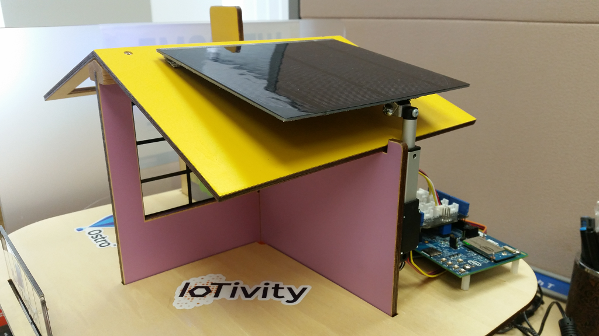
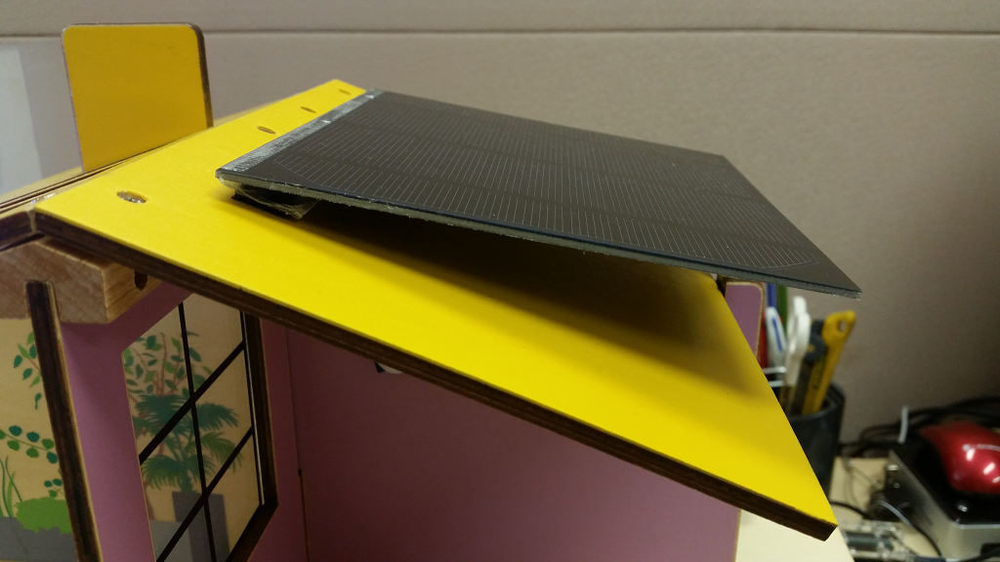
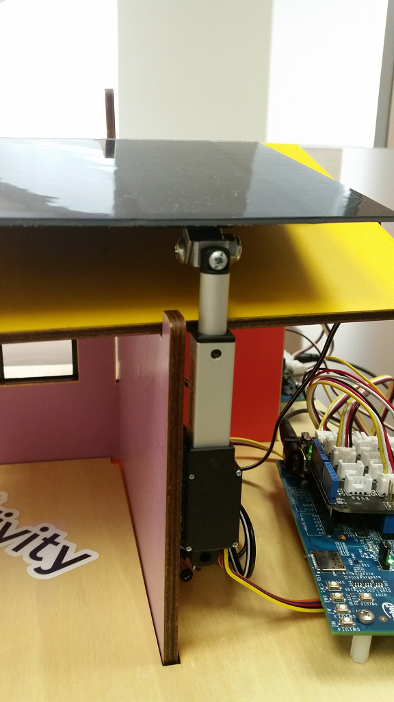
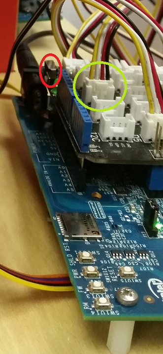

# JavaScript OCF servers
This folder contains JavaScript implementation of various OCF servers, such as:
* Fan
* CO2 detector
* Motion Sensor
* RGB LED
* LED (on/off)
* Buzzer
* Ambient Light Sensor
* Temperature
* Button
* Switch
* Solar Panel

# Setting up the OCF servers

## Setting up the HW devices/sensors
The mapping between sensors and connectors below was derived from the corresponding `*.js` files. Please double-check in the code (`*.js`) in case of problems as the table may have gone out-of-sync.

| OCF server | Connector | HW device |
|------------|-----------|-----------|
| Fan | GPIO 9 | [Grove Mini Fan](http://www.seeedstudio.com/wiki/Grove_-_Mini_Fan) |
| CO2 (carbonDioxide) | A0 analog pin | [Grove - Gas Sensor(MQ2)](http://www.seeedstudio.com/depot/Grove-Gas-SensorMQ2-p-937.html) |
| Motion Sensor | GPIO 5 | [Grove PIR Motion Sensor](http://www.seeedstudio.com/depot/Grove-PIR-Motion-Sensor-p-802.html) |
| RGB LED | GPIO 7 (clock) and 8 (data) | [Grove Chainable RGB LED](http://www.seeedstudio.com/depot/twig-chainable-rgb-led-p-850.html?cPath=156_157) |
| LED | GPIO 2 | [Grove LED Socket kit](http://www.seeedstudio.com/wiki/Grove_-_LED) |
| Buzzer | GPIO 6 | [Grove Buzzer](http://www.seeedstudio.com/wiki/Grove_-_Buzzer) |
| Ambient Light Sensor (Illuminance) | A3 analog pin | [Grove Light Sensor](http://www.seeedstudio.com/depot/Grove-Light-Sensor-p-746.html) |
| Temperature | A1 analog pin | [Grove Temperature Sensor](http://www.seeedstudio.com/depot/Grove-Temperature-Sensor-p-774.html) |
| Button | GPIO 4 | [Grove Button](http://www.seeedstudio.com/wiki/Grove_-_Button) |
| button-toggle [note] | GPIO 4 | [Grove Button](http://www.seeedstudio.com/wiki/Grove_-_Button) |
| Switch | GPIO 4 | [Grove Switch(P)](http://www.seeedstudio.com/wiki/Grove_-_Switch(P)) |

[note]: This is a variation of the classical `Button` implemenation in that it makes the button act as a toggle between `true` and `false` (instead of reporting `true` when pressed and `false` otherwise.

## Software
All the OCF servers in these folders are written in JavaScript and leverage `iotivity-node` (IoTivity JavaScript bindings) as well as the MRAA JavaScript bindings to access and control the busses (e.g. I2C, GPIO, Analog, etc.). We assume you already have installed [node.js](https://nodejs.org/) on your system, please refer to the [node.js](https://nodejs.org/) website or your OS documentation for how to install it if that is not the case.

You will also need to install a set of tools and development libraries to build [IoTivity](https://wiki.iotivity.org). Here is an example when running Ubuntu: [build dependencies for Ubuntu](https://wiki.iotivity.org/build_iotivity_with_ubuntu_build_machine). Once ready, proceed to the following sections to:
1. Install the `node.js` dependencies
2. Start the OCF servers

First of all, copy the content of this Github repository to your target system (we assume that this entire repo has been copied under `/opt` throughout the rest of this document):
```
$ cd /opt
$ sudo git clone https://github.com/01org/SmartHome-Demo
$ cd SmartHome-Demo
```

### Node.js dependencies

Here are the `node.js` dependencies that you need to install next:
* [IoTivity-node](https://www.npmjs.com/package/iotivity-node): this is in fact automatically pulled in when installing the [IoT REST API Server]
* [mraa](https://www.npmjs.com/package/mraa): it is technically optional. If no `mraa` module is installed, all OCF servers will be running in simulation mode. This could be useful if you don't have the physical sensors or if your platform is not fully supported by `mraa`.
* [lodash.mergewith](https://www.npmjs.com/package/lodash.mergewith): This is needed by the 'json-to-cbor' script to create appropriate ACLs when security mode is enabled.
* [lodash.assignin](https://www.npmjs.com/package/lodash.assignin): This is needed by the 'json-to-cbor' script to create appropriate ACLs when security mode is enabled.
* [uuid](https://www.npmjs.com/package/uuid): This is needed by the 'json-to-cbor' script to create appropriate ACLs when security mode is enabled.

Example:
```
$ cd /opt/SmartHome-Demo
$ sudo npm install iotivity-node lodash.mergewith lodash.assignin uuid
$ sudo npm install mraa #optional
```

### How to start the OCF servers

  1. Starting services manually
  ```
  $ cd /opt/SmartHome-Demo
  $ /usr/bin/node ocf-servers/js-servers/<ocf-server>.js &
  ```

  Using the CO2 detector as an example:
  ```
  $ cd /opt/SmartHome-Demo
  $ /usr/bin/node ocf-servers/js-servers/gas.js &
  ```

  2. Automating things with `systemd`

  For those Linux operating systems that use `systemd`, we provide `systemd` service files in the [`systemd-files`](./systemd-files) folder. Follow these few steps below to use those:
  ```
  $ sudo cp -r /opt/SmartHome-Demo/ocf-servers/js-servers/systemd-files/* /lib/systemd/system/
  $ sudo systemctl daemon-reload
  $ sudo systemctl start <ocf-server>
  ```

If you want those to be started automatically when you bring up the system, enable them in `systemd`:
```
$ sudo systemctl enable <ocf-server>
```

Note that if your Operating System has an active firewall, it will most likely block the IoTivity network traffic by default. A brute-force approach is to disable the firewall altogether as follows (assuming `iptables` and `ip6tables` are used):
```
$ sudo systemctl disable iptables
$ sudo systemctl disable ip6tables
```
A better solution would be to open up just the ports that are required. Port 5683 is used by the CoAP protocol during the device discovery phase, 5684 is used for secured traffic (*note:* this will be used when IoTivity turns on the `SECURED` compile-time flag) and other (random) ports are used later to communicate with the device. If you wish to open up just the required ports, you can do so as follows:
```
$ sudo iptables -A INPUT -p udp --dport 5683 -j ACCEPT
$ sudo iptables -A INPUT -p udp --dport 5684 -j ACCEPT
```
To open ports for the IPv6 traffic, do:
```
$ sudo ip6tables -A INPUT -s fe80::/10 -p udp -m udp --dport 5683 -j ACCEPT
$ sudo ip6tables -A INPUT -s fe80::/10 -p udp -m udp --dport 5684 -j ACCEPT
```
A range of ports can also be specified as follows:
```
$ sudo iptables -A INPUT -p udp --dport <start>:<end> -j ACCEPT
$ sudo ip6tables -A INPUT -s fe80::/10 -p udp -m udp --dport <start>:<end> -j ACCEPT
```

It is possible to automatically open up these ports whenever an OCF server is started by `systemd`. For an example on how we do exactly this (for different ports) for the Gateway services, please take a look inside the [gateway folder](../../gateway/systemd-files/). More specifically, you should look at the files inside the `<unit-name>.service.d` folder. The files in there were tested on Ubuntu 16.04 and Fedora 25.

## Setting up the Smart Solar Panel
### Hardware components required
* 1x [Solar Panel]
* 1x [Line Actuator]
* 1x [Actuator Control Board]
* 1x [Grove LCD RGB panel]

### Setting up the Solar Panel HW components
1. Mount the [Solar Panel] and [Line Actuator] as shown in the following pictures (the [Actuator Control Board] is not visible in those pictures, refer to point 2 below for more details on how to connect all three components together):



2. Connect the [Line Actuator] to the [Actuator Control Board] as follows: ![control-to-actuator] (./.pics/control-to-actuator.png)
3. Connect the [Actuator Control Board] to the [Intel® Edison Board for Arduino] using the `RC` connector as follows: ![control-to-edison] (./.pics/control-to-edison.png) and following the table below:

  | Actuator | Edison |
  |:---:|:---:|
  | **-** | `GND` |
  | **+** | `5V` |
  | **RC** | `Digital PWM pin 3` |

4. Connect the [Grove LCD RGB panel] to any `I2C` connector on the [Grove Base Shield] that is installed on your [Intel® Edison Board for Arduino] as highlighted in the green circle on the following picture. Please make sure that the `Vcc` power switch (highlighted in red on the picture below) on the [Grove Base Shield] is set to 5V to ensure proper operation of the [Grove LCD RGB panel].

  

### Starting the Smart Solar Panel OCF server
In order to get all components to work correctly, you will also need to make sure the following JavaScript bindings are available:

| Peripheral | Node.js module |
|:---:|:---:|
| Solar Panel | `mraa` |
| LCD | `jsupm_i2clcd` |

Not having those available will disable the corresponding device and switch to simulation mode.

Once you are all set, start the OCF server as follows: **`node solar.js &`**

[Solar Panel]: http://www.adafruit.com/products/200
[Line Actuator]: http://www.robotshop.com/en/firgelli-technologies-l12-30-210-12-p.html
[Actuator Control Board]: http://www.robotshop.com/en/firgelli-technologies-linear-actuator-control-board.html
[Grove LCD RGB panel]: http://www.seeedstudio.com/wiki/Grove_-_LCD_RGB_Backlight
[Grove Base Shield]: https://www.seeedstudio.com/base-shield-v13-p-1378.html?cPath=132_134
[Intel® Edison Board for Arduino]: http://www.intel.com/content/www/us/en/support/boards-and-kits/intel-edison-boards/intel-edison-board-for-arduino.html
