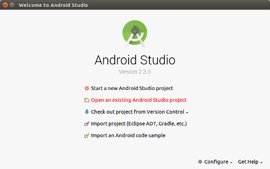
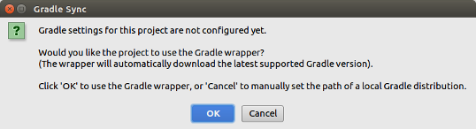
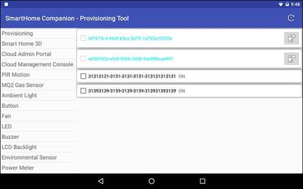
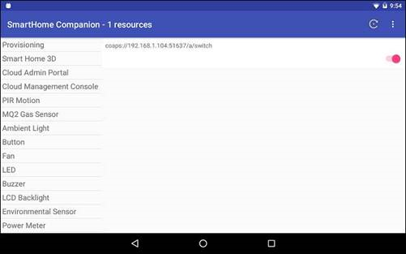

## Android companion app for the IoT to Cloud Smart Home demo

This folder contains the source code of the Android companion app used in the [IoT to Cloud Smart Home demo]. The demo leverages [OCF] and [IoTivity] to access smart appliances (OCF servers) from the Home gateway (OCF client) and the cloud based web portal. The companion app, which is an OCF client, serves as a debugging tool for validating the sensors and actuators deployed in the demo, and also as a provisioning client for onboarding and provisioning the unmanaged OCF devices.

### Build Instructions

You could build the companion app with the Android Studio, or build the app in a Docker container.

#### Build with Android Studio
1. The companion app requires Android Studio to build. Follow the [installation guide](https://developer.android.com/studio/index.html) to setup the Android Stduio before building the companion app.
2. Reference the [Android build instructions](https://wiki.iotivity.org/android_build_instructions) provided in the IoTivity project to build the IoTivity base library for Android in `.AAR` archive. Note that the `TARGET_ARCH` command-line build argument must match the processor architecture of your target Android device.
3. The above IoTivity build instructions for Android imports the generated `.AAR` library as a dependency module for the current Android Studio project. To make the library available to all Android Studio projects, install the above IoTivity base library for Android archive to local maven repository with the following command.
<pre>$ mvn install:install-file -Dfile=iotivity-base-x86-release.aar -DgroupId=org.iotivity -DartifactId=base -Dversion=1.3.1-secured -Dpackaging=aar
</pre>
4. Clone the source code of the [IoT to Cloud Smart Home demo repo], and open the project Gradle file `build.gradle` in the Android Studio to create the project for the companion app. The Gradle wrapper may need to be set up while import the project first time, then click <b>Build &gt; Make Module 'app'</b> to build the companion app using Gradle, or click the <b>Run</b> action button to build and deploy the app to the connected Android device.

#### Build with Docker

1. Reference the [Docker Installation Guide](https://docs.docker.com/engine/installation/) to install the Docker on your development machine.
2. Clone the source code of the [IoT to Cloud Smart Home demo repo], and build a container image with the following command in the Companion app source folder. The image will include Android SDK, build tools, and IoTivity base library for Android for compiling the companion app in next step.
<pre>$ git clone https://github.com/01org/SmartHome-Demo.git
$ cd SmartHome-Demo/smarthome-companion
$ sudo docker build -t iotivity-android .
</pre>
3. Run the container in the Companion app folder with the following command, to generate the APK file for being installed to the Android device supporting API 21 (Android 5.0) or above.
<pre>$ sudo docker run -it --rm -v `pwd`:/opt/mnt iotivity-android
</pre>
4. Once successfully built the app in the container, the resulting APK will be generated at `app/build/outputs/apk/app-debug.apk` inside the Companion source folder.

### Permission of Accessing External Storage

Since Android 6.0 (API level 23), users grant permissions to apps while the app is running, not when they install the app. You could give the app access to the required resources, and revoke the permissions at any time by going to the app's Settings screen. Grant the permission of accessing external storage to the Companion app from the Android Settings app for storing the provisioning and SVR databases.

### Supported Resource Types

The companion app supports the following resource types, and represents the resources using Android [CardViews](https://developer.android.com/training/material/lists-cards.html#CardView) with relevant widgets for users to control the linked resources.

| Sensor / Actuator | Resource Type |
|-------------------|---------------|
| PIR motion sensor | [oic.r.sensor.motion](https://oneiota.org/revisions/2368) |
| MQ2 gas sensor | [oic.r.sensor.carbondioxide](https://oneiota.org/revisions/2453) |
| Ambient light sensor | [oic.r.sensor.illuminance](https://oneiota.org/revisions/2370) |
| Button | oic.r.button |
| Fan | oic.r.fan |
| LED | [oic.r.switch.binary](https://oneiota.org/revisions/2468) |
| Buzzer | oic.r.buzzer |
| LCD backlight | [oic.r.colour.rgb](https://oneiota.org/revisions/2378) |
| Environmental sensor | oic.r.sensor.environment |
| Power meter | oic.r.energy.consumption |
| Solar panel | oic.r.solar |
| Audio control | [oic.r.audio](https://oneiota.org/revisions/2427) |
| MP3 player | x.com.intel.demo.mp3player |

[IoT to Cloud Smart Home demo]: https://github.com/01org/SmartHome-Demo
[OCF]: https://openconnectivity.org/
[IoTivity]: https://www.iotivity.org/
[IoT to Cloud Smart Home demo repo]: https://github.com/01org/SmartHome-Demo
