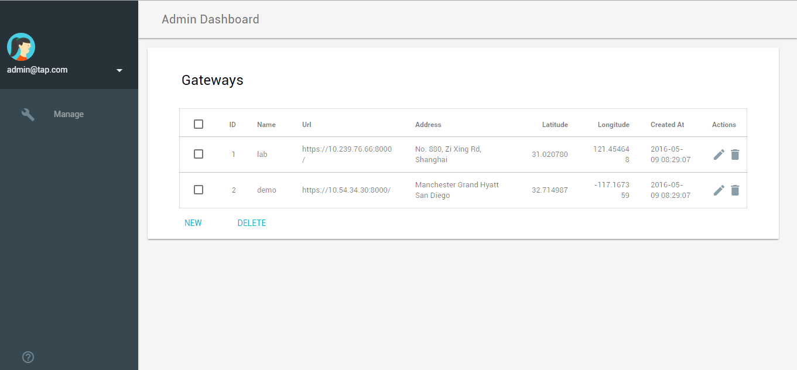

Smart Home Web Portal in a Docker Container
===========================================

Here are the steps to run the Smart Home Web Portal in a Docker container.

## Prerequisites
* Install Docker on your system (please refer to the instructions located [here](https://docs.docker.com/engine/installation/) for this)
* Internet connection is required to load the resources and JavaScripts from external websites

## Steps to run the container
1. Checkout source code
    * Checkout the source to build the image:
    ```
    $ git clone https://github.com/01org/SmartHome-Demo
    ```
    * Get in the `smarthome-web-portal` folder:
    ```
    $ cd SmartHome-Demo/smarthome-web-portal
    ```

2. Configurations
    * Choose an Ubuntu mirror that is close to you (optional)
        - Uncomment the last two lines below in the Dockerfile:
        ```
        # Uncomment the two lines below if you wish to use an Ubuntu mirror repository
        # that is closer to you (and hence faster). The 'sources.list' file inside the
        # 'tools/docker/' folder is set to use one of Ubuntu's official mirror in Taiwan.
        # You should update this file based on your own location. For a list of official
        # Ubuntu mirror repositories, check out: https://launchpad.net/ubuntu/+archivemirrors
        #COPY tools/docker/sources.list /etc/apt
        #RUN rm /var/lib/apt/lists/* -vf
        ```
        - Update `tools/docker/sources.list` file according to your own location    
        eg. change `free.nchc.org.tw` to the closest [mirror site](https://launchpad.net/ubuntu/+archivemirrors)

3. Getting the Docker image
   There are two options (described in step 3.1 and 3.2 respectively) to get the Docker image. We recommend using option 3.1 as it is simpler and quicker.

   + 3.1 Pre-built Docker image
       * Download the pre-built image hosted on [Docker Hub](https://hub.docker.com/r/smarthome2cloud/smarthome-cloud/) by running the command below.
       ```
       $ sudo docker pull smarthome2cloud/smarthome-cloud
       ```

   + 3.2 Build the image
       * Under the `smarthome-web-portal` folder, run the command below to build the image. *smarthome2cloud* is the username registered in Docker hub; *smarthome-cloud* is the repository name; *smarthome2cloud/smarthome-cloud* is the image name and *latest* is the tag of the image. The Docker hub username is optional if the image is only for local use.
          ```
          $ sudo docker build -t smarthome2cloud/smarthome-cloud:v1 .
          ```
       * If the container is running behind a proxy, set up the http and https proxies through build args as below:
           ```
           $ sudo docker build --build-arg http_proxy=http://<ip-of-your-proxy>:<port-of-the-proxy> --build-arg  https_proxy=https://<ip-of-your-proxy>:<port-of-the-proxy>  -t smarthome2cloud/smarthome-cloud:v1 .
           ```
        **NOTE**: if you are using a corporate proxy, the proxy host name may not be parsed by the container's local DNS. Better to use IP address instead of hostname.
    * When completed, you will see the following message:
        ```
        Removing intermediate container 82b756f0b245
        Successfully built 5efd905d09df
        ```
    * This command will show the image status
        ```
        $ sudo docker images
        ```

4. Run the portal in a container in the background
   * **Option 1**: with the `docker0` bridge network    
      * When running the `smarthome-cloud` container on the bridge network, we recommend publishing port 3000 and 4000 to a local port.
        ```
        $ sudo docker run -d --name portal -p 3030:3000 -p 3031:4000 smarthome2cloud/smarthome-cloud:latest
        ```
        **portal** is the name of the container;    
        **3030** is the forward port listening on the host. All the requests will be forwarded to the portal on 3000 in the container;    
        **3031** is the forward port listening on the host, which forwards the requests to admin portal running on 4000 in the container;    
        **smarthome2cloud/smarthome-cloud:latest** is the combination of the name and tag of the image(the tag would be 'v1' if the container was built locally);    
   * **Option 2**: directly on the host network
       ```
       $ sudo docker run --network host -d --name portal smarthome2cloud/smarthome-cloud:latest
       ```
    **NOTE**: if the container is running in a corporate network, please add an environmental variable to pass the proxy to the container    
       ```
       $ sudo docker run -d -e proxy=<ip-of-your-proxy>:<port-of-the-proxy> --name portal -p 3030:3000 -p 3031:4000 smarthome2cloud/smarthome-cloud:latest
       ```

5. Point the portal to the gateway server
   * Open the admin portal through `http://<host-ip-addr>:3031`
   * Enter the default login credentials: admin/admin
   * Click the Gateway tab on the left hand and update the gateway IP and geo location for gateway *"demo"*    
      
   * Restart the container (Refer to step 6 on how to get the container id)
      ```
      $ sudo docker restart <container id>
      ```
   * Login to the Home portal through `http://<host-ip-addr>:3030` (login credentials: OTC/!otivity)

6. The Cloud portal supports multiple gateways for multiple users. If you want to add more users/gateways, refer to the [wiki](https://github.com/01org/SmartHome-Demo/wiki/How-to-manage-users-and-gateways-in-the-admin-portal) on how to manage users and gateways in the admin portal

7. Load analytics data in the admin portal, refer to the [wiki](https://github.com/01org/SmartHome-Demo/wiki/How-to-load-weather-and-power-prediction-data-automatically%3F) on how to load the power and temperature prediction data automatically

8. Troubleshooting the container
    * `$ sudo docker ps -a`    
    Checks all the running containers and get the id and status of the containers. The output looks like this:
    ```
    CONTAINER ID        IMAGE                       COMMAND                  CREATED             STATUS              PORTS      NAMES
    20be297949be        smarthome2cloud/portal:v0   "/usr/bin/supervisord"   49 minutes ago      Up 47 minutes       0.0.0.0:3030->3000/tcp, 0.0.0.0:3031->4000/tcp   portal0
    ```
    * `$ sudo docker logs -f <container id>`    
    You can get the <container id> from `docker ps -a`. The command gets the latest 10 lines of the log output and continuously waits for new output.
    * `$ sudo docker start/stop/restart <container id>`    
    Update the container status